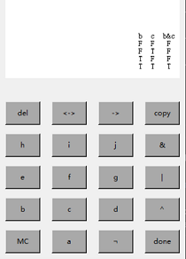

# TruthTableGenerator

Generate truth table according to logic expressions.

## Logic Expressions

- `!`, `~`, `not`, `¬` are the same.
- `&`, `*`, `and`, `∧`, are the same.
- `|`, `+`, `or`, `∨`, `v` are the same.
- `<->`, `↔` are the same.
- `->`, `→` are the same.
- `^`, `⊕` are the same.

## Usage for python3 environment

Python3 is required, See help using `python TruthTableGenerator.py` or `python3 TruthTableGenerator.py`

``` bash
usage: [-h | --help] [-i | --input <file path>]
           [-o | --output <file path>] [-c | --console]
           [-m | --markdown] [-r | --reverse ]
    [-i | --input <file path>]
        input from <file path>
    [-o | --output <file path>]
        output the result to <file path>
    [-c | --console]
        console mode (default)
    [-m | --markdown]
        generate markdown table
    [-r | --reverse]
        reverse the enumerate order (default F -> T)

```

## Usage for others

using `TruthTableGenerator.exe` to use a GUI calculator to calculate directly. 

You only need to download the `TruthTableGenerator.exe` and click it.



## Feature

- It can input expressions from a file and generate tables for expressions in each line.
- It can generate a markdown table by using command.
- You can copy your table by clicking the `copy` button on GUI.


## Notice
- You cannot use variable names that contain numbers.
- You'd better use no more than four variables, otherwise the GUI will not display properly.
